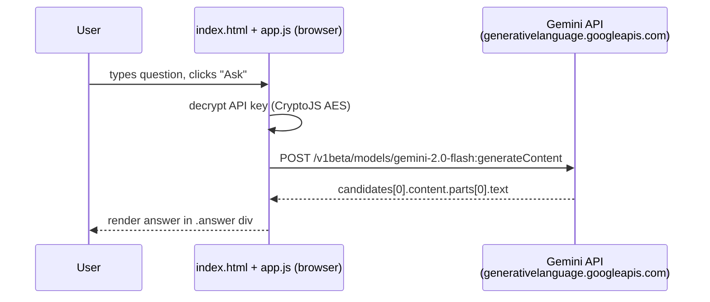

# ChatBot

**A minimal, zero-build web chat client for Google Gemini.**

🔗 **Live demo:** https://nakultt.github.io/ChatBot/

ChatBot is a single-page HTML, CSS and vanilla JavaScript app. You type a question, the browser sends it straight to the Gemini `generateContent` REST API, and the answer is rendered on the page. It has no backend or bundler, and it is hosted on GitHub Pages.

---

## Features

- One-box "ask a question, get an answer" interface
- Calls **Gemini 2.0 Flash** directly from the browser through the REST API
- Plain HTML, CSS and JS: open `index.html` and it works
- Deployed as a static site on GitHub Pages

## Architecture



| File | Role |
|---|---|
| `index.html` | Layout: heading, input box, Ask button, answer panel. Loads CryptoJS from cdnjs. |
| `app.js` | `askquestion()`: reads the input, builds the Gemini request, handles errors and renders the response. |
| `stylesheet.css` | Styling for the chat UI. |

## Running locally

```bash
git clone https://github.com/nakultt/ChatBot.git
cd ChatBot
# any static server works
python -m http.server 8000
# open http://localhost:8000
```

To use your own key, replace the key handling in `app.js` with your Gemini API key from [Google AI Studio](https://aistudio.google.com/).

> ⚠️ **Security note:** any key shipped to the browser is visible to users, and AES encryption with a passphrase stored in the same file does not hide it. For anything beyond a demo, move the Gemini call behind a small server or serverless function that holds the key.

## Tech stack

HTML5 · CSS3 · Vanilla JavaScript (Fetch API) · CryptoJS · Google Gemini API · GitHub Pages

## License

See [LICENSE](LICENSE).
